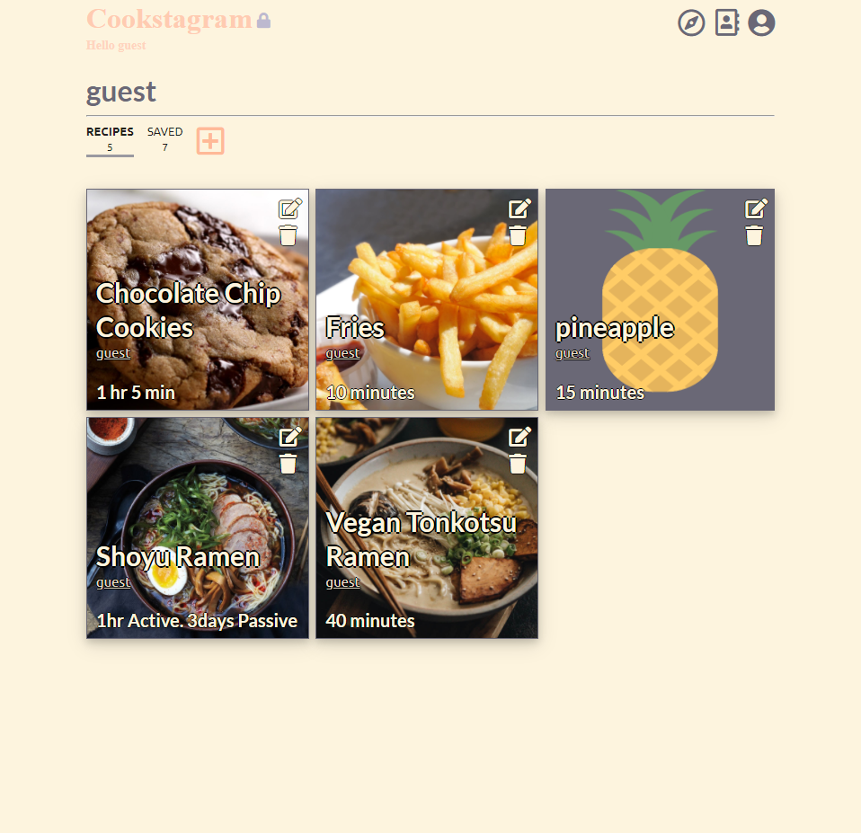
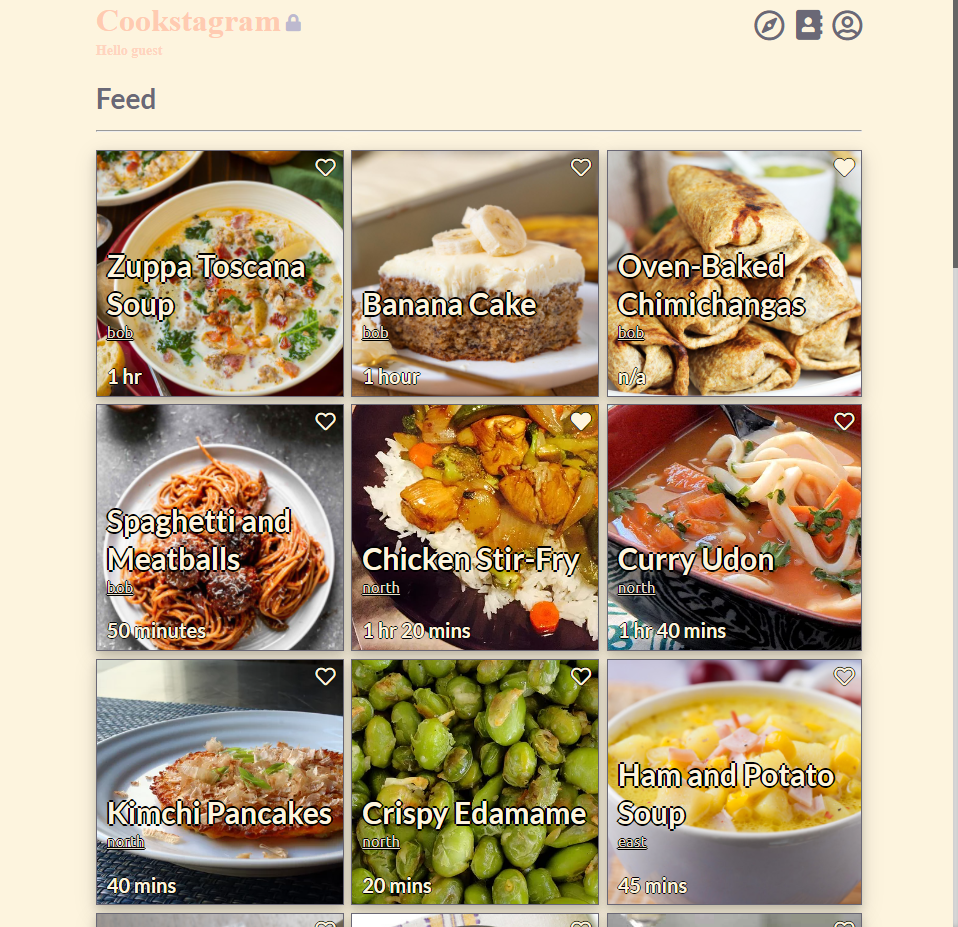
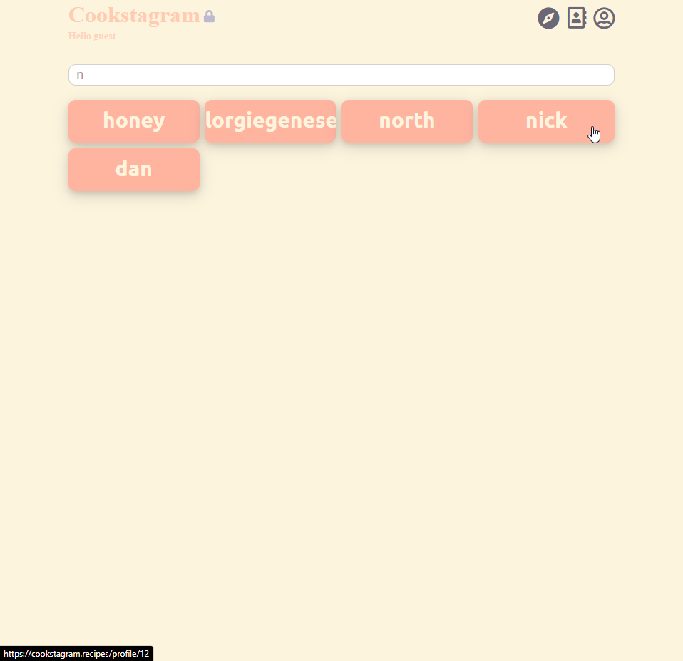
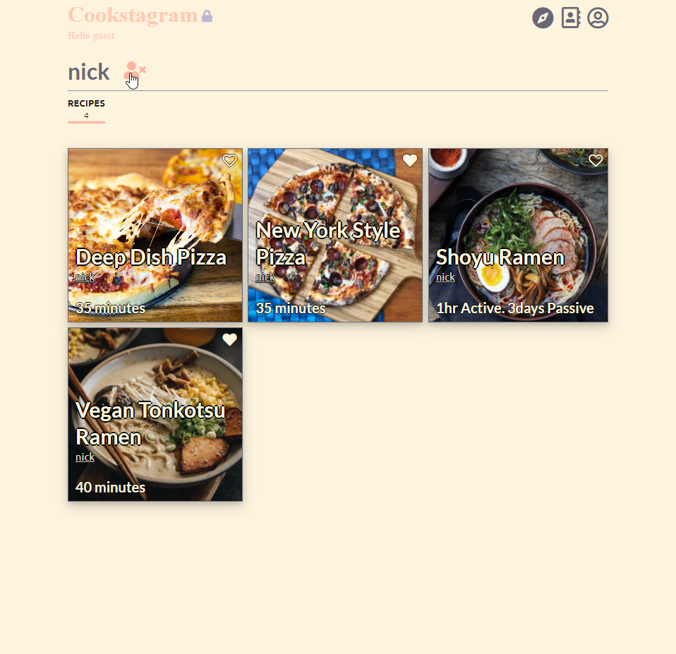

Hosted at https://cookstagram.recipes
<h1>Cookstagram</h1>

A recipe-sharing social network application where users can create their own recipes or explore others’ recipes to save to their collection.

Profile |  Feed
:-------------------------:|:-------------------------:
  |   

Profile |  Feed
:-------------------------:|:-------------------------:
  |  

<h2>Features</h2>

- Register an account or click "Try it out!" to use the app.

- Create, edit, delete your own recipes.

- Go to the explore page to search other users' profiles. Add users whose recipes you like to your friends list.

- Check your feed to keep up with all the recipes your friends have added.

- See a recipe you like? Favorite it by clicking the heart, and quickly access it from your own profile.

<h2>Installation</h2>

Install dependencies:

Navigate to the root project folder and run the following command to install the necessary Python dependencies:

> pip install -r backend/requirements.txt

Generate a Django secret key and place in line 23 of 'Cookstagram/backend/appmain/settings.py'

Create the database by navigating to 'Cookstagram/backend/' and running the following two commands:

> python manage.py makemigrations

> python manage.py migrate

Navigate to 'Cookstagram/frontend/'. Install node dependencies by running the following:

> npm i
